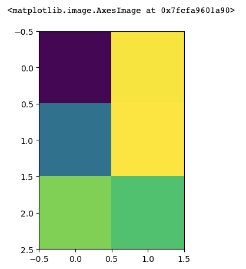

# View data as an image

Use `imshow` to view your data as a 2-D image.

```python
import numpy as np
import matplotlib.pyplot as plt
%matplotlib inline  # for jupyter notebook

tmp = np.random.rand(3, 2)
print(tmp)
plt.imshow(tmp)

#   [[0.01424035 0.67437124]
#    [0.26121813 0.68051496]
#    [0.55202248 0.49235785]]
```

